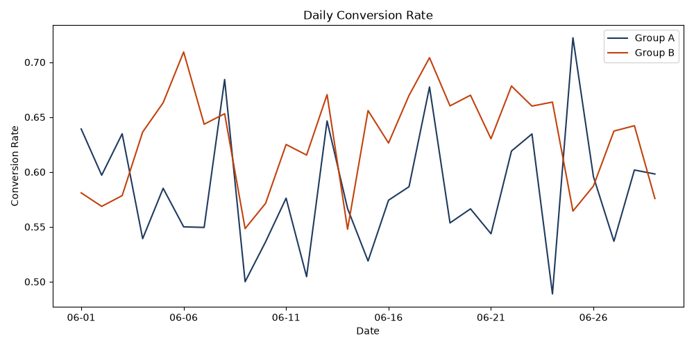
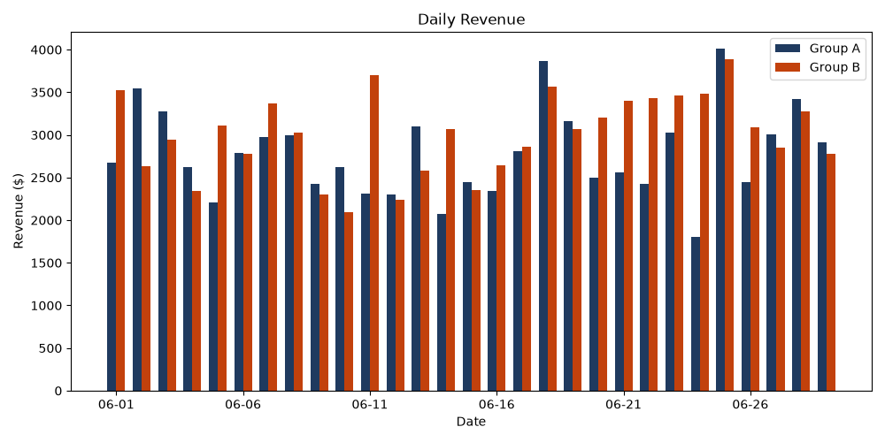

# 🧪 E-Commerce A/B Testing Pipeline

A complete experimentation case study that evaluates whether adding **Apple Pay
and Google Pay** to the checkout page can improve conversion and revenue. The
project turns a business question into a reproducible workflow using **Python,
MySQL, statistical testing, and Streamlit**.


---

## 💼 Executive Summary

Checkout is one of the most commercially sensitive parts of an e-commerce
journey. Even small reductions in payment friction can turn more existing
checkout users into customers without increasing acquisition spend.

This project simulates an experiment in which:

- **Control A** uses the existing checkout experience.
- **Variant B** places Apple Pay and Google Pay at the top of the final payment
  step.

> **Business question:** Should the company roll out the new express-payment
> experience to all customers?

### Result at a glance

| Business KPI | Control A | Variant B | Change | Statistical result |
|---|---:|---:|---:|---|
| Checkout conversion rate | 63.63% | 67.39% | **+3.77 pp / +5.92%** | Significant, p = 0.005603 |
| ARPU | $16.13 | $17.42 | **+$1.29 / +7.97%** | Significant, p = 0.046058 |
| Purchasers | 1,555 | 1,645 | **+90 / +5.79%** | Descriptive |
| Revenue | $80,661.20 | $87,087.05 | **+$6,425.85 / +7.97%** | Descriptive |

**Case-study decision:** Variant B passes the primary conversion criterion and
moves revenue in the right direction. In a real experiment, the recommended
next step would be a **controlled phased rollout**, not an immediate 100%
release, because the secondary ARPU result is close to the significance
threshold and below its pre-planned 10% MDE.

> **Important:** The data in this repository is synthetic and reproducible. The
> findings demonstrate the decision process and pipeline; they are not evidence
> about real customers or a real payment product.

---

## 🎯 Business Problem

Customers who reach checkout already show strong purchase intent, but a long or
inconvenient payment experience can still cause abandonment. The product team
wants to place express-payment buttons above the standard payment form so that
eligible customers can complete an order with fewer steps.

The change may create value in two ways:

1. **Convert more checkout users** by reducing payment friction.
2. **Increase revenue per visitor** without spending more on traffic.

However, a positive-looking result can still be misleading if the groups are
unbalanced, the experiment stops too early, or random variation is mistaken for
a genuine treatment effect. This project therefore combines business metrics
with experiment-quality checks and formal hypothesis tests.

---

## 🧠 Experiment Strategy

### Hypotheses

**Null hypothesis (H₀):** Adding Apple Pay and Google Pay does not change
checkout conversion or ARPU.

**Alternative hypothesis (H₁):** The new payment experience changes checkout
conversion and/or ARPU.

### Experiment design

| Design choice | Definition |
|---|---|
| Unit of randomization | User |
| Population | 10,000 synthetic e-commerce users |
| Allocation | 50% Control A / 50% Variant B |
| Control | Existing checkout experience |
| Variant | Apple Pay and Google Pay promoted at the payment step |
| Historical period | 1 March–31 May 2025 |
| Experiment period | 1–30 June 2025 |
| Significance level | α = 0.05 |
| Statistical power target | 80% |
| Primary metric MDE | 5% relative improvement |
| Secondary metric MDE | 10% relative improvement |

### Metrics that drive the decision

#### Primary metric — Checkout Conversion Rate

The primary question is whether more users who start checkout complete a
purchase.

```text
Conversion Rate = Unique purchasers ÷ Unique checkout users
```

CR is the primary metric because the proposed change happens directly at the
payment step.

#### Secondary metric — Average Revenue per User (ARPU)

ARPU checks whether the experience improves overall commercial value rather
than merely changing the final click.

```text
ARPU = Purchase revenue ÷ Unique users with a product view
```

#### Experiment-quality checks

| Check | Why it matters |
|---|---|
| Sample Ratio Mismatch (SRM) | Detects broken or biased traffic allocation |
| Historical A/A test | Confirms that the split behaves similarly when no treatment is active |
| Fixed randomization seed | Makes this portfolio demonstration reproducible |

A production experiment should additionally monitor payment failures, refunds,
page latency, average order value, support contacts, and other guardrail
metrics. Those outcomes are outside the synthetic dataset used here.

---

## 📐 Sample-Size Planning

Historical behavior is used to estimate the traffic required for the chosen
MDE, α = 0.05, and 80% power.

| Metric | Historical baseline | Absolute MDE | Planned sample per group | Estimated duration |
|---|---:|---:|---:|---:|
| CR | 66.62% | 3.33 pp | 3,146 | 0.65 months |
| ARPU | $16.86 | $1.69 | 8,051 | 1.65 months |

The one-month test covers the pipeline's traffic estimate for the primary
metric, while ARPU requires a longer planned duration. There is also an
important production improvement to make: CR planning currently uses viewers
to estimate duration, while the final Z-test uses checkout users as its
denominator. A real test should align these populations before launch.

---

## ✅ Experiment Validation

The pipeline validates the experiment before interpreting the final uplift.

| Validation | Result | Interpretation |
|---|---:|---|
| Group allocation | 5,000 A / 5,000 B | Exact 50:50 split |
| SRM test | p = 1.0000 | No allocation anomaly detected |
| Historical A/A — CR | p = 0.9316 | No pre-treatment CR imbalance detected |
| Historical A/A — Revenue | p = 0.8383 | No pre-treatment revenue imbalance detected |

These checks do not prove that every possible bias is absent, but they remove
three common reasons for distrusting an experiment result.

---

## 📊 Results and Business Interpretation

### Funnel performance

| Funnel stage | Control A | Variant B | Difference |
|---|---:|---:|---:|
| Viewed | 5,000 | 5,000 | 0 |
| Added to basket | 3,928 | 3,899 | -29 |
| Reached checkout | 2,444 | 2,441 | -3 |
| Purchased | 1,555 | 1,645 | **+90** |

Traffic entering checkout is almost identical, while Variant B produces more
purchases. That is consistent with the intended mechanism: the intervention is
at the final payment step rather than earlier in the shopping funnel.

### Statistical tests

- **Conversion:** a two-proportion Z-test compares purchase completion among
  checkout users. The observed relative lift is **5.92%**, with p = **0.005603**.
- **ARPU:** a two-sided Mann–Whitney U test compares skewed user-level revenue
  distributions. The observed relative lift is **7.97%**, with p = **0.046058**.

Both p-values are below 0.05. However, statistical significance alone is not a
business decision. The primary metric clears its 5% MDE, while ARPU does not
clear its planned 10% MDE and has not reached its planned sample size.

<p align="center">
  
  
</p>

### Recommended action in a real business setting

1. Advance Variant B to a limited, monitored rollout.
2. Continue collecting data until the secondary-metric plan is satisfied.
3. Monitor payment errors, refunds, latency, AOV, and customer-support contacts.
4. Confirm that the result is stable by device, market, and customer type.
5. Roll out fully only if the conversion gain remains positive without harming
   guardrails.

---

## 🔄 End-to-End Workflow


Running `python run_pipeline.py` executes the following stages in order:

| Stage | File | Responsibility |
|---:|---|---|
| 1 | `scripts/test_connection.py` | Verifies Python-to-MySQL connectivity |
| 2 | `scripts/generate_ecomm_data.py` | Resets demo rows and generates balanced, synthetic event data |
| 3 | `scripts/fix_sample_size.py` | Estimates sample size and experiment duration |
| 4 | `scripts/validate_experiment.py` | Runs A/A and SRM checks |
| 5 | `scripts/collect_experiment_data.py` | Builds daily aggregates, CSV outputs, and charts |
| 6 | `scripts/analyse_experiment_data.py` | Runs final CR and ARPU tests and stores results |
| 7 | `dashboard/app.py` | Queries MySQL and presents the decision interactively |

The generator uses random seed `42`. Each full run deletes the previous demo
rows and recreates the same synthetic experiment when the code and configuration
remain unchanged. It does not drop the database schema.

---

## 🗄️ Data Model

| MySQL object | Purpose |
|---|---|
| `Experiments` | Experiment name, hypothesis, and status |
| `UserAssignments` | Stable A/B assignment for each user |
| `EventLogs` | Raw views, basket additions, checkouts, purchases, and revenue |
| `DailyMetrics` | Daily event and revenue aggregates by group |
| `MonthlyCumulativeUniqueUsers` | Cumulative reporting metrics |
| `ExperimentMetrics` | Final effect sizes, p-values, significance, and sample sizes |
| `vw_ExperimentDailyFunnel` | Dashboard-ready daily funnel data |
| `vw_ExperimentGroupComparison` | Side-by-side A/B metric comparison |

---

## 🗂️ Project Structure

```text
E-Commerce-A-B-Testing-Pipeline/
│
├── dashboard/
│   └── app.py                         # Interactive Streamlit dashboard
│
├── scripts/
│   ├── config.example.ini             # Safe local configuration template
│   ├── create_tables_mysql.sql         # MySQL database and tables
│   ├── create_views_mysql.sql          # Reporting views
│   ├── create_procedures_mysql.sql     # Optional Workbench query helpers
│   ├── data_exchange.py                # Local/cloud SQLAlchemy connection
│   ├── db_queries.py                   # Reusable parameterized SQL
│   ├── generate_ecomm_data.py          # Reproducible synthetic data
│   ├── fix_sample_size.py              # Power and duration planning
│   ├── validate_experiment.py          # A/A and SRM validation
│   ├── collect_experiment_data.py      # Aggregation and chart generation
│   └── analyse_experiment_data.py      # Final hypothesis tests
│
├── assets/                             # Generated charts and CSV summaries
├── run_pipeline.py                     # Runs all Python stages in order
├── requirements.txt                    # Python dependencies
├── SETUP_MAC_MYSQL.md                  # Detailed Mac/MySQL setup guide
└── README.md
```

---

## 🛠️ Tools and Technologies

| Layer | Technology |
|---|---|
| Business analysis | A/B testing, funnel analysis, CR, ARPU, MDE |
| Statistical analysis | SciPy, two-proportion Z-test, Mann–Whitney U, chi-square |
| Data processing | Python, Pandas, NumPy, Faker |
| Database | MySQL Community Server and MySQL Workbench |
| Database access | SQLAlchemy and PyMySQL |
| Dashboard | Streamlit |
| Version control | Git and GitHub |

---

## ⚙️ Run Locally on macOS

### 1. Clone and install

```bash
git clone https://github.com/Build-with-Priyanshu/E-Commerce-A-B-Testing-Pipeline.git
cd E-Commerce-A-B-Testing-Pipeline
python3 -m venv .venv
source .venv/bin/activate
python -m pip install -r requirements.txt
```

### 2. Create the MySQL objects

Open MySQL Workbench and execute these files in order:

1. `scripts/create_tables_mysql.sql`
2. `scripts/create_procedures_mysql.sql`
3. `scripts/create_views_mysql.sql`

The procedures are convenient Workbench helpers; the Python pipeline uses the
parameterized queries in `scripts/db_queries.py`.

### 3. Configure the local connection

```bash
cp scripts/config.example.ini scripts/config.ini
```

Enter your MySQL username and password in `scripts/config.ini`. This real file
is ignored by Git.

### 4. Run the experiment pipeline

```bash
python run_pipeline.py
```

### 5. Open the dashboard

```bash
python -m streamlit run dashboard/app.py
```

For troubleshooting and detailed instructions, see
[SETUP_MAC_MYSQL.md](SETUP_MAC_MYSQL.md).

---

## ☁️ Deploy the Streamlit Dashboard

The dashboard code can be hosted free on Streamlit Community Cloud, but a cloud
deployment cannot reach MySQL at `127.0.0.1` on your Mac. It needs an online
MySQL-compatible database containing the same tables, views, and results.

When deploying, select:

```text
Repository: Build-with-Priyanshu/E-Commerce-A-B-Testing-Pipeline
Branch: main
App file: dashboard/app.py
```

Add the cloud database credentials in Streamlit's **Advanced settings** using
the variable names in `.streamlit/secrets.toml.example`.

---

## 🔒 Security Notes

- `scripts/config.ini` contains the real local password and is excluded by
  `.gitignore`.
- `.streamlit/secrets.toml` is also excluded and must never be committed.
- Only placeholder templates are stored in GitHub.
- SQL queries that receive parameters use SQLAlchemy bind parameters rather
  than string-building user input.

---

## 🚀 Production Improvements

- Align CR sample-size planning with the final checkout-user denominator.
- Replace synthetic generation with real event ingestion from the product.
- Add payment-error, refund, latency, AOV, and retention guardrails.
- Add confidence intervals alongside p-values and point estimates.
- Add segment diagnostics while controlling for multiple comparisons.
- Add scheduled execution, data-quality alerts, and automated test reporting.
- Containerize the pipeline and dashboard for repeatable deployment.

---

## 👤 Author

**Priyanshu Dwivedi**

<p>
  <a href="https://www.linkedin.com/in/priyanshu-x-dwivedi">
    
  </a>
  &nbsp;
  <a href="mailto:priyanshud.0001@gmail.com">
    
  </a>
</p>
